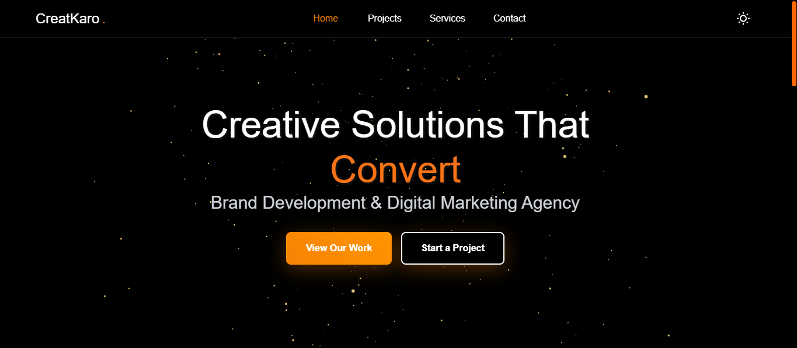

# CreatKaro Agency Website


A modern, interactive, and visually stunning website for **CreatKaro Creative Agency** built with React, TypeScript, and Three.js.  
Features 3D animations, smooth page transitions, dark/light mode, and a responsive design that showcases the agency's creative services and projects.

---

## 📑 Table of Contents
- [Features](#features)
- [Demo](#demo)
- [Installation](#installation)
- [Usage](#usage)
- [Folder Structure](#folder-structure)
- [Technologies Used](#technologies-used)
- [Configuration](#configuration)
- [Contributing](#contributing)
- [License](#license)
- [FAQ](#faq)
- [Acknowledgments](#acknowledgments)

---

## ✨ Features
- **3D Animations**: Interactive Three.js scenes with particle systems and animated logos  
- **Dark/Light Mode**: Toggle between dark and light themes with persistent settings  
- **Smooth Transitions**: Framer Motion powered page transitions and micro-interactions  
- **Responsive Design**: Fully responsive layout that works on all devices  
- **Modern UI**: Material-UI components with custom styling and branding  
- **State Management**: Zustand for efficient global state management  
- **Performance Optimized**: Code splitting with React.lazy and Suspense  
- **Accessibility**: Reduced motion support and keyboard navigation  
- **Contact Form**: Functional contact form with validation and error handling  

---

## 🎥 Demo


🔗 **Live Demo**: [creatkaro.com](https://creatkaro.com)

---

## ⚙️ Installation
Follow these steps to set up the project locally:

```bash
# Clone the repository
git clone https://github.com/your-username/creatkaro-website.git
cd creatkaro-website

# Install dependencies
npm install

# Start development server
npm start

```

Visit **http://localhost:3000** to view the website.

---

## 🚀 Usage

### Development
```bash
npm run dev
```

### Build for Production
```bash
npm run build
```

### Testing
```bash
npm test
```

### Deployment
- **Vercel**
```bash
npm install -g vercel
vercel
```
- **Netlify**  
  - Connect repository  
  - Set build command: `npm run build`  
  - Set publish directory: `build`  

---

## 📂 Folder Structure
```text
src/
├── components/
│   ├── 3D/                 # Three.js components
│   │   ├── AnimatedLogo.tsx
│   │   ├── ParticleSystem.tsx
│   │   ├── ProjectCard3D.tsx
│   │   └── Scene3D.tsx
│   └── UI/                 # UI components
│       ├── CTAButton.tsx
│       ├── LoadingScreen.tsx
│       └── Navigation.tsx
├── pages/                  # Page components
│   ├── Contact.tsx
│   ├── Home.tsx
│   ├── Projects.tsx
│   └── Services.tsx
├── store/                  # State management
│   ├── useStore.ts
│   └── types.ts
├── App.tsx                 # Main app component
└── index.tsx               # App entry point
```

---

## 🛠️ Technologies Used
- **Frontend Framework**: React 18 with TypeScript  
- **3D Graphics**: Three.js, @react-three/fiber, @react-three/drei  
- **Animation**: Framer Motion  
- **UI Components**: Material-UI (MUI)  
- **Routing**: React Router DOM  
- **State Management**: Zustand  
- **Build Tool**: Create React App  
- **Styling**: CSS3, MUI theming, Tailwind CSS  

---

## 🔧 Configuration

### Environment Variables
Create a `.env` file in the root directory:
```env
REACT_APP_API_URL=your_api_url_here
REACT_APP_CONTACT_EMAIL=your_contact_email
REACT_APP_GA_TRACKING_ID=your_ga_tracking_id
```

### Theme Customization
```tsx
// Theme context provides dark/light mode switching
const { theme, toggleTheme } = useTheme();
```

### 3D Scene Configuration
```tsx
<Scene3D
  enableControls={true}
  showLogo={true}
  showParticles={true}
  cameraPosition={[0, 0, 8]}
>
  {/* Custom 3D content */}
</Scene3D>
```

---

## 🤝 Contributing
We welcome contributions!

1. Fork the repository  
2. Create a feature branch: `git checkout -b feature/amazing-feature`  
3. Commit changes: `git commit -m 'Add amazing feature'`  
4. Push to branch: `git push origin feature/amazing-feature`  
5. Open a pull request  

### Code Style
- Use TypeScript types  
- Document components  
- Format with Prettier  
- No `console.log` in production  

---

## 📜 License
This project is licensed under the **MIT License** - see the [LICENSE](LICENSE) file for details.

---

## ❓ FAQ

**Q: How do I add a new page?**  
A: Create a new component in `pages/`, add a route in `App.tsx`, and update navigation.  

**Q: How do I customize 3D elements?**  
A: Modify components in `components/3D/`. See React Three Fiber docs.  

**Q: How do I update project data?**  
A: Edit mock data in `store/useStore.ts` or connect a CMS/API.  

**Q: Animations are too intense.**  
A: The site supports reduced motion preferences in device accessibility settings.  

---

## 🙏 Acknowledgments
- [Three.js](https://threejs.org/) community  
- [Framer Motion](https://www.framer.com/motion/)  
- [Material-UI](https://mui.com/)  
- [React Three Fiber](https://docs.pmnd.rs/react-three-fiber)  
- All contributors ❤️  

For more info visit [creatkaro.com](https://creatkaro.com)  
## Contact US
- Gmail: **ubaidjaved500@gmail.com**  
- Github: **https://github.com/MUbaidJavaid**
